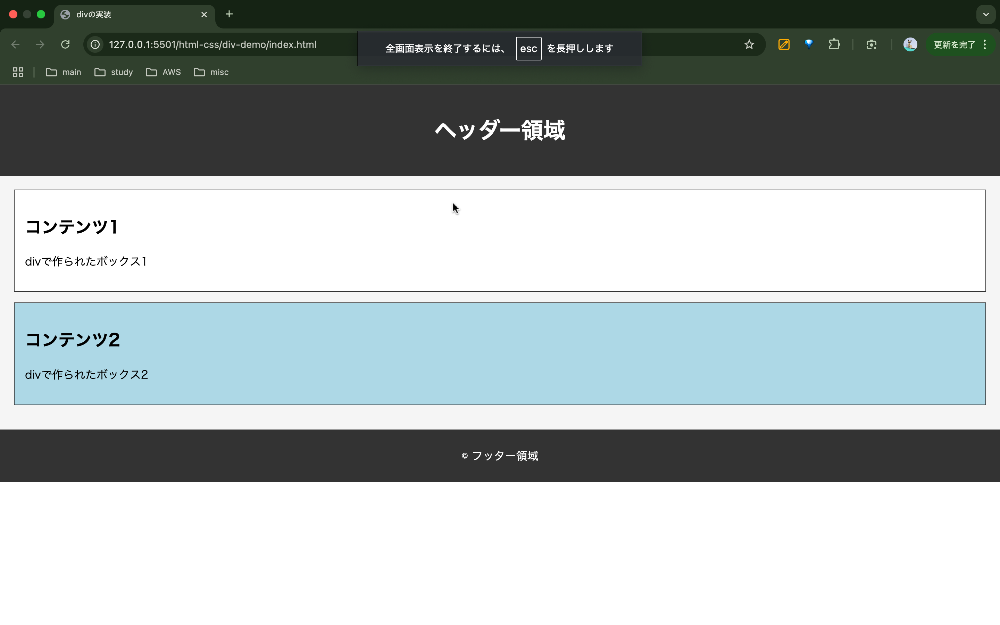

# 評価シート【フロントエンド】

## 目次
- HTML
    - [divタグの実装](#divタグ)
    - [aタグの実装](#aタグ)
    - [ul、liタグの実装](#ulliタグ)
    - [pタグの実装](#pタグ)
    - [formタグの実装](#formタグ)
    - [tableタグの実装](#tableタグ)

- JavaScript
    - [console.log](#console.log)
    - [let,const,var (変数宣言)](#let,const,var (変数宣言))
    - [if文](#if文)
    - [switch文](#switch文)
    - [while文](#while文)
    - [for文](#for文)
    - [array文](#array文)
    - [object](#object)
    - [undefined-null](#undefined-null)
    - [function](#function)
    - [class](#class)

## HTML
### divタグ

| 特性 | 説明 |
|------|------|
| 役割 | コンテンツをグループ化するためのブロック |
| スタイルの適用 | スタイルやスクリプトを適用するために使用 |
| ブロックの配置 | レイアウトやデザインを整理する |

### 画像

### aタグ

| 特性 | 説明 |
|------|------|
| 役割 | HTMLでWebページにハイパーリンクを設置する |
| リンク先 | 他のWebサイトやページへのリンク |
|  | 同一ページ内での指定した他の箇所へのリンク |
|  | 指定メールアドレスが入力されたメールソフトを開く |
|  | クリックすると電話がかかるリンク |
|  | ダウンロードできるリンク |

### ul、liタグ

| 特性 | 説明 |
|------|------|
| 役割 | HTMLで項目や要素の一覧を表示するために使用 |
| <ul> | 順不同リストのコンテナ |
| <li> | リスト内の項目 |

### pタグ

| 特性 | 説明 |
|------|------|
| 役割 |  テキストの段落を表す。|

### spanタグ

| 特性 | 説明 |
|------|------|
| 役割 | テキストの一部にスタイルを適用したり、JavaScriptで操作したりするために使用 |
| スタイルの適用 | スタイルやスクリプトを適用するために使用 |

### headタグ

| 特性 | 説明 |
|------|------|
| 役割 | HTML ドキュメントのメタデータを格納 |
| <title> | ブラウザのタイトルバーやタブに表示されるテキストを定義 |
| <link> | 外部リソース（主にCSSファイル）へのリンクを定義 |

### footerタグ

| 特性 | 説明 |
|------|------|
| 役割 | フッターを表す。著作権情報、連絡先情報、サイトマップなど |
| © | コピーライト記号を表示するために使用 |

### bodyタグ

| 特性 | 説明 |
|------|------|
| 役割 | HTML ドキュメントの主要なコンテンツを格納する |
| 含まれる内容 | テキスト、画像、他の HTML 要素など、実際にブラウザに表示されるもの |

### formタグ

| 特性 | 説明 |
|------|------|
| action 属性 | 送信先の URL |
| method 属性 | 送信方法の指定 |

### selectタグ

| 特性 | 説明 |
|------|------|
| id | この要素の一意の識別子 |
| name | フォームデータとして送信される際のパラメータ名 |

### textareaタグ

| 特性 | 説明 |
|------|------|
| id | この要素の一意の識別子 |
| name | フォームデータとして送信される際のパラメータ名 |
| 役割 | 複数行のテキストを入力するテキスト領域 |
| rows cols | 初期表示時のテキストエリアの高さ 幅 |

### tableタグ

| 特性 | 説明 |
|------|------|
| `<table>` | 表全体のコンテナを定義するタグ |
| `<tr>` | 表の1つの行を定義するタグ (Table Row) |
| `<th>` | 表のヘッダーセル（見出しセル）を定義するタグ (Table Header) |
| `<td>` | 表のデータセル（通常のセル）を定義するタグ (Table Data) |
| 使用例 | 製品リスト、ユーザー情報、データ表示など、構造化された情報の表示 |

## JavaScript

### console.log

| 特性 | 説明 |
|------|------|
| 役割 | Webブラウザの開発者ツールコンソールに情報を出力する |
| 基本構文 | `console.log(データ1, データ2, ...);` |
| 利便性1 | シンプルなメッセージ表示: コードの特定の場所が実行されたことの確認や、簡単な情報の表示に使用する。
| 利便性2 | 変数の内容表示: プログラム実行中の変数の現在の値を確認できる。
| 利便性3 | 複数の異なる型の値を同時に表示: 関連する複数の情報を一度に出力できる。
| 利便性4 | 複雑なデータ構造（オブジェクトと配列）の表示: 複雑なデータ構造も、コンソール上で展開して確認できる。 |
| 使用例 | 計算結果の表示、ユーザー入力の確認、プログラムの各段階での状態出力 |

### let,const,var (変数宣言)

| 特性 | 説明 |
|------|------|
| `let` | 値の変更が可能な変数。ブロック内で有効（ブロックスコープ）。 |
| `const` | 値の変更が不可能な定数。ブロック内で有効（ブロックスコープ）。宣言時に初期値が必須。 |
| `var` | (非推奨) 値の変更が可能な変数。関数内で有効（関数スコープ）。現代のJavaScriptでは使われない。 |
| 使用例 | 値の変化、定数の設定、変数の有効範囲の理解に利用。 |

#### var を使ってはいけない主な理由

`var` は以下の理由から推奨されません。

1.  **スコープの問題**: `var` はブロックを無視し、関数全体またはグローバルで有効になります。これにより、意図しない上書きやバグの原因になります。`let`や`const`はこれを防ぎます。
2.  **巻き上げ (Hoisting) の混乱**: 宣言前に使用すると`undefined`となり、コードの予測が難しくなります。
3.  **再宣言の許可**: 同じ名前の変数を何度も再宣言できるため、意図しない上書きのリスクがあります。

### if文

| 特性 | 説明 |
|------|------|
| 役割 | 条件に基づいて処理を分岐させる |
| 基本構文 | `if (条件) { // 条件が真の場合の処理 } else { // 条件が偽の場合の処理 }` |
| 使用例 | ユーザーの年齢による表示内容の変更、入力値のバリデーションなど |

### switch文

| 特性 | 説明 |
|------|------|
| 役割 | 一つの値に基づいて複数の処理を分岐させる |
| 基本構文 | `switch (式) { case 値1: // 処理; break; case 値2: // 処理; break; default: // 処理; }` |
| 使用例 | 曜日や月の番号による表示の切り替え、メニュー選択の処理など |

### while文

| 特性 | 説明 | 
|------|------| 
| 役割 | 指定された条件が真である限り、コードブロックを繰り返し実行する | 
| 基本構文 | `while (条件式) { // 繰り返したい処理 }` | 
| 注意点 | 無限ループにならないよう、ループ内で条件式が必ず `false` になるように変更を加える必要があります。そうしないと無限ループとなり、ブラウザがフリーズする可能性があります。 | 
| 使用例 | 特定の合計値に達するまで数字を足し続ける、ユーザーからの連続した入力処理など。

### for文

| 特性 | 説明 |
|------|------|
| 役割 | 特定の回数だけコードブロックを繰り返し実行する |
| 基本構文 | `for (初期化; 条件式; 更新式) { // 繰り返したい処理 }` |
| 注意点 | 無限ループにならないよう、条件式が常に `true` にならないように注意が必要です。そうしないとブラウザがフリーズする可能性があります。 |
| 使用例 | カウンタを特定の回数だけ繰り返す場合、例えば0から4まで順に処理を実行する場合など。 |

### array文

| 特性 | 説明 | 
|------|------|
| 役割 | 複数のデータを順序付けて一つにまとめる |
| 基本構文 | `let arrayName = [要素1, 要素2, ...];` |
| 使用例① (長さの取得) | `arrayName.length` で要素数を取得 |
| 使用例② (末尾に追加) | `arrayName.push(新しい要素)` で末尾に追加 |
| 使用例③ (末尾から削除) | `arrayName.pop()` で末尾から削除 |
| 注意点 | インデックスは `0` から始まる。存在しないインデックスにアクセスすると `undefined`。 |
| 使用例 | リスト、コレクション、データの集合の管理 |

### object

| 特性 | 説明 |
|------|------|
| 役割 | 複数のデータ（プロパティ）とそれに関連する機能（メソッド）を一つにまとめる |
| 基本構文 (定義) | `let objName = { key1: value1, key2: value2 };` |
| 基本構文 (メソッド) | `method1: function() {}` |
| 操作① (プロパティアクセス) | `objName.key` または `objName['key']` で値を取得 |
| 操作② (プロパティ変更) | `objName.key = newValue` で値を変更 |
| メソッド利用 | `objName.method()` でオブジェクト内の機能を実行 |
| 使用例 | 書籍情報、ユーザーデータ、設定値などの管理 |

### undefined-null

| 特性 | 説明 |
|------|------|
| 役割 | `undefined` は「未定義の状態」、`null` は「意図的に空であること」を示す |
| 発生する場面 | `undefined`: 変数を宣言しただけ、存在しないプロパティへのアクセス`null`: 初期値として明示、DOM取得で要素が存在しない場合など |
| 基本構文 (undefined) | `let a;`（値が代入されていない） |
| 基本構文 (null) | `let b = null;`（意図的に空として初期化） |
| typeof の結果 | `typeof undefined` → `"undefined"` `typeof null` → `"object"`（仕様による） |
| 使用例 | `undefined`: 未初期化変数の確認、存在しないプロパティチェック `null`: 初期化済みの空データ、DOM取得結果の確認 |
| 注意点 | `undefined` は JS が自動で設定することが多い `null` は開発者が明示的に設定するケースが多い |

### function

| 特性 | 説明 |
|------|------|
| 役割 | 一連の処理をまとめ、再利用可能にするための仕組み |
| 通常の定義 | `function 関数名(引数) { 処理; return 戻り値; }` |
| アロー関数 | `const 関数名 = (引数) => { 処理; return 戻り値; }`（より簡潔な構文） |
| 引数の利用 | 関数に渡す値。関数内部で処理に使用される（例：`function add(a, b)`） |
| 戻り値の利用 | `return` で処理結果を関数の外に返す（例：`return a + b`） |
| 呼び出し方法 | `関数名(引数)` の形式で呼び出し、戻り値を受け取れる |
| 使用例 | 計算処理、挨拶文の生成、複数結果のまとめなど |

### class-instance
| 特性 | 説明 |
|------|------|
| 役割 | クラス：共通する性質（プロパティ）と機能（メソッド）をまとめた設計図 インスタンス：クラスから生成された具体的なオブジェクト |
| 基本構文| `class クラス名 { constructor(...) { ... } メソッド名() { ... } }` |
| インスタンス生成 | `const obj = new クラス名(値1, 値2);` のように、クラスの `constructor` に値を渡すことで、インスタンスのプロパティに初期値を設定できる |
| プロパティ | `this.プロパティ名` でクラス内部に値を保持 |
| メソッド | クラス内に定義された関数。`obj.メソッド名()` で呼び出し |
| 使用例 | ユーザー情報（名前・年齢）を持つ User クラスを作成し、複数のユーザーインスタンスを生成して活用する |
| constructor | インスタンス生成時に自動的に実行される初期化用のメソッド。引数を受け取ってプロパティを設定する。例：`constructor(name, age) { this.name = name; }` |
| this | そのインスタンス自身を指す。プロパティやメソッドへアクセスするために使う。例：`this.name` はインスタンスの `name` にアクセスする。 |
| new | クラスからインスタンスを生成するキーワード。例：`const user1 = new User("太郎", 25);` |