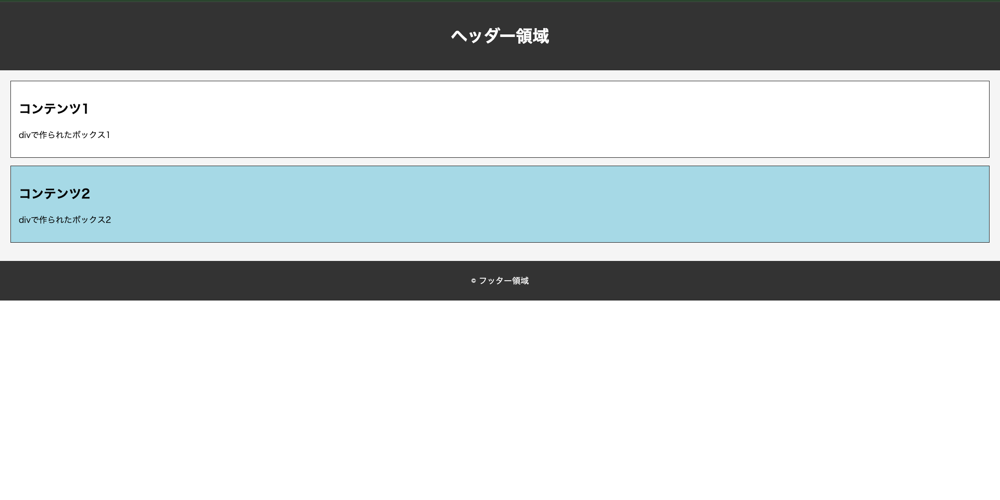

# 評価シート【フロントエンド】

## 目次
- HTML
    - [divタグの実装](#user-content-divタグ)
    - [aタグの実装](#user-content-aタグ)

## divタグ
| 特性 | 説明 |
|------|------|
| 役割 | コンテンツをグループ化するためのブロック |
| スタイルの適用 | スタイルやスクリプトを適用するために使用 |
| ブロックの配置 | レイアウトやデザインを整理する |

## 画像

## aタグ
| 特性 | 説明 |
|------|------|
| 役割 | HTMLでWebページにハイパーリンクを設置する |
| リンク先 | 他のWebサイトやページへのリンク |
| | 同一ページ内での指定した他の箇所へのリンク |
| | 指定メールアドレスが入力されたメールソフトを開く |
| | クリックすると電話がかかるリンク |
| | ダウンロードできるリンク |